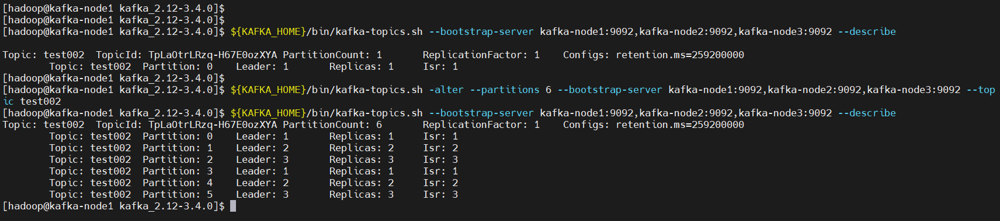

## 一、概述
Kafka是由Apache基金会开发的分布式流处理平台，采用发布-订阅模式，支持高吞吐量、低延迟的数据传输。主要用于处理实时数据管道、数据存储和数据分析等大数据应用场景。Kafka采用高效的数据压缩算法，可以在集群中存储大量的数据，并通过分区机制来实现数据的高可靠性和可扩展性。Kafka常用于以下场景：

- **数据管道**：在数据采集和分发过程中构建可扩展的流式数据管道，用于实时数据处理和分析。例如，数据收集、日志聚合、网络追踪、用户活动跟踪等。

- **数据存储**：将Kafka作为持久化存储来存储大量的数据，以便用于后续的批量处理和离线分析，例如数据挖掘、机器学习等应用场景。

- **实时流处理**：通过将Kafka与追求低延迟的流式处理平台，例如Apache Storm、Apache Samza和Apache Flink等相结合，可以实现实时数据处理和分析。这是许多实时数据分析和日志处理需求的主要场景。

- **系统日志跟踪**：通过Kafka将来自不同系统的日志数据统一收集和存储，便于进行统一的日志分析和事件跟踪，在软件开发过程中可以快速定位和解决问题。

> 总之，Kafka是高性能、可靠、可扩展的分布式流处理平台，可用于实时数据管道、数据存储、实时流处理和日志跟踪等多个领域。它已被广泛应用于各种大数据场景，并成为了大数据架构中的一个重要组成部分。


这里只是讲解kafka容器快速部署，用于测试和学习作用，生成不建议使用容器部署，想了解更多的kafka知识点可参考我这篇文章：[Kafka原理介绍+安装+基本操作](https://mp.weixin.qq.com/s?__biz=MzI3MDM5NjgwNg==&mid=2247486467&idx=1&sn=8a92efe6658f3cba30ac4f1d708a6d36&chksm=ead0f0eadda779fc31ac6e5b03a134041918a3c4b80c9195b07408fa651d5f06a25081a59d3f&token=1796595267&lang=zh_CN#rd)

## 二、前期准备
### 1）部署 docker
```bash
# 安装yum-config-manager配置工具
yum -y install yum-utils

# 建议使用阿里云yum源：（推荐）
#yum-config-manager --add-repo https://download.docker.com/linux/centos/docker-ce.repo
yum-config-manager --add-repo http://mirrors.aliyun.com/docker-ce/linux/centos/docker-ce.repo

# 安装docker-ce版本
yum install -y docker-ce
# 启动并开机启动
systemctl enable --now docker
docker --version
```
### 2）部署 docker-compose
```bash
curl -SL https://github.com/docker/compose/releases/download/v2.16.0/docker-compose-linux-x86_64 -o /usr/local/bin/docker-compose

chmod +x /usr/local/bin/docker-compose
docker-compose --version
```

## 三、创建网络

```bash
# 创建，注意不能使用hadoop_network，要不然启动hs2服务的时候会有问题！！！
docker network create hadoop-network

# 查看
docker network ls
```

## 四、安装 Zookeeper
Zookeeper在Kafka中扮演重要的角色，主要用于管理Kafka集群的元数据和实现Kafka集群的协调和管理。在Kafka集群中，Zookeeper主要有以下作用：

- **配置管理**：Kafka集群的配置信息存储在ZK节点中，包括Kafka Broker的配置信息、Topic的分区信息、消费者和生产者的相关配置等。Kafka可以通过ZK感知集群状态的变化，并自动重新分配Topic的分区和对应的Broker。

- **Broker控制**：Kafka集群中的所有Broker都连接到ZK中。ZK维护了所有活动Broker的列表和状态信息，包括Leader、Follower等信息。如果某个Broker出现故障，ZK可以自动感知它的下线，并通知集群中的其他Broker重新分配Leader。

- **分布式锁**：Zookeeper提供群众同步的机制，使得多个Kafka Broker的协调和管理变得可行。Kafka中的一些操作需要集群中的所有Broker都达成一致意见，因此需要使用ZK协调器的分布式锁机制来维护这些操作的一致性，并防止数据的意外损坏。

Zookeeper快速部署教程可参考我上一篇文章：[【中间件】通过 docker-compose 快速部署 Zookeeper 保姆级教程](https://mp.weixin.qq.com/s?__biz=MzI3MDM5NjgwNg==&mid=2247487997&idx=1&sn=ef0dc95033f374dc8cc76aeb149e459d&chksm=ead0ed14dda76402a396a826913159826efa9e727cf8033986eec006f9b821afec07e065ca6c&token=1796595267&lang=zh_CN#rd)

总之，Zookeeper在Kafka集群中发挥了重要的角色，它管理着**Kafka的发布/订阅机制、Broker状态信息、Topic的元数据信息等**，使得Kafka集群的分布式协同和协调变得可能。在Kafka写操作（生产者或管理员在Kafka生产或维护上修改了配置）上，ZK用于协作锁定。在Kafka读操作（消费者将订阅的主题分区元数据读取到kafka消费者中）上，ZK用于协作。

## 五、Kafka 编排部署
### 1）下载 Kafka

```bash
wget https://downloads.apache.org/kafka/3.4.0/kafka_2.12-3.4.0.tgz --no-check-certificate
```
注意还需要java环境，可以去官网下载，也可以在我下面提供的地址下载：
> 链接: [https://pan.baidu.com/s/1o_z3t16v0eASYWN4VcjYeg?pwd=kuac](https://pan.baidu.com/s/1o_z3t16v0eASYWN4VcjYeg?pwd=kuac) 提取码: `kuac` 

### 2）配置
- `config/kafka-node1/server.properties`
```bash
# 常见配置挂载目录
mkdir config/{kafka-node1,kafka-node2,kafka-node3} -p

# 配置
cat >config/kafka-node1/server.properties<<EOF
#broker的全局唯一编号，不能重复
broker.id=1

#删除topic功能使能
delete.topic.enable=true
#处理网络请求的线程数量
num.network.threads=3
#用来处理磁盘IO的现成数量
num.io.threads=8
#发送套接字的缓冲区大小
socket.send.buffer.bytes=102400
#接收套接字的缓冲区大小
socket.receive.buffer.bytes=102400
#请求套接字的缓冲区大小
socket.request.max.bytes=104857600
#kafka数据的存储位置
log.dirs=/opt/apache/kafka/logs
#指定Topic的分区数量，这里设置为3。 默认只有一个分区，设置多分区可以支持并发读写和负载均衡
num.partitions=3
#副本，默认只有一个副本，不会进行数据备份和冗余
replication.factor=3
#用来恢复和清理data下数据的线程数量
num.recovery.threads.per.data.dir=1
#segment文件保留的最长时间，超时将被删除
log.retention.hours=168
#配置连接Zookeeper集群地址
zookeeper.connect=zookeeper-node1:2181,zookeeper-node2:2181,zookeeper-node3:2181
#zookeeper连接超时时间
zookeeper.connection.timeout.ms=60000
EOF
```
- `config/kafka-node2/server.properties`

```bash
cat >config/kafka-node2/server.properties<<EOF
#broker的全局唯一编号，不能重复
broker.id=2

#删除topic功能使能
delete.topic.enable=true
#处理网络请求的线程数量
num.network.threads=3
#用来处理磁盘IO的现成数量
num.io.threads=8
#发送套接字的缓冲区大小
socket.send.buffer.bytes=102400
#接收套接字的缓冲区大小
socket.receive.buffer.bytes=102400
#请求套接字的缓冲区大小
socket.request.max.bytes=104857600
#kafka数据的存储位置
log.dirs=/opt/apache/kafka/logs
#指定Topic的分区数量，这里设置为3。 默认只有一个分区，设置多分区可以支持并发读写和负载均衡
num.partitions=3
#副本，默认只有一个副本，不会进行数据备份和冗余
replication.factor=3
#用来恢复和清理data下数据的线程数量
num.recovery.threads.per.data.dir=1
#segment文件保留的最长时间，超时将被删除
log.retention.hours=168
#配置连接Zookeeper集群地址
zookeeper.connect=zookeeper-node1:2181,zookeeper-node2:2181,zookeeper-node3:2181
#zookeeper连接超时时间
zookeeper.connection.timeout.ms=60000
EOF
```
- `config/kafka-node3/server.properties`

```bash
cat >config/kafka-node3/server.properties<<EOF
#broker的全局唯一编号，不能重复
broker.id=3

#删除topic功能使能
delete.topic.enable=true
#处理网络请求的线程数量
num.network.threads=3
#用来处理磁盘IO的现成数量
num.io.threads=8
#发送套接字的缓冲区大小
socket.send.buffer.bytes=102400
#接收套接字的缓冲区大小
socket.receive.buffer.bytes=102400
#请求套接字的缓冲区大小
socket.request.max.bytes=104857600
#kafka数据的存储位置
log.dirs=/opt/apache/kafka/logs
#指定Topic的分区数量，这里设置为3。 默认只有一个分区，设置多分区可以支持并发读写和负载均衡
num.partitions=3
#副本，默认只有一个副本，不会进行数据备份和冗余
replication.factor=3
#用来恢复和清理data下数据的线程数量
num.recovery.threads.per.data.dir=1
#segment文件保留的最长时间，超时将被删除
log.retention.hours=168
#配置连接Zookeeper集群地址
zookeeper.connect=zookeeper-node1:2181,zookeeper-node2:2181,zookeeper-node3:2181
#zookeeper连接超时时间
zookeeper.connection.timeout.ms=60000
EOF
```
### 3）启动脚本 bootstrap.sh

```bash
#!/usr/bin/env sh

${KAFKA_HOME}/bin/kafka-server-start.sh ${KAFKA_HOME}/config/server.properties
```
### 4）构建镜像 Dockerfile

```bash
FROM registry.cn-hangzhou.aliyuncs.com/bigdata_cloudnative/centos:7.7.1908

RUN rm -f /etc/localtime && ln -sv /usr/share/zoneinfo/Asia/Shanghai /etc/localtime && echo "Asia/Shanghai" > /etc/timezone

RUN export LANG=zh_CN.UTF-8

# 创建用户和用户组，跟yaml编排里的user: 10000:10000
RUN groupadd --system --gid=10000 hadoop && useradd --system --home-dir /home/hadoop --uid=10000 --gid=hadoop hadoop -m

# 安装sudo
RUN yum -y install sudo ; chmod 640 /etc/sudoers

# 给hadoop添加sudo权限
RUN echo "hadoop ALL=(ALL) NOPASSWD: ALL" >> /etc/sudoers

RUN yum -y install install net-tools telnet wget nc less

RUN mkdir /opt/apache/

# 添加配置 JDK
ADD jdk-8u212-linux-x64.tar.gz /opt/apache/
ENV JAVA_HOME /opt/apache/jdk1.8.0_212
ENV PATH $JAVA_HOME/bin:$PATH

# 添加配置 kafka server
ENV KAFKA_VERSION 2.12-3.4.0
ADD kafka_${KAFKA_VERSION}.tgz /opt/apache/
ENV KAFKA_HOME /opt/apache/kafka
RUN ln -s /opt/apache/kafka_${KAFKA_VERSION}-bin $KAFKA_HOME

# 创建数据存储目录
RUN mkdir -p ${KAFKA_HOME}/data/logs

# copy bootstrap.sh
COPY bootstrap.sh /opt/apache/
RUN chmod +x /opt/apache/bootstrap.sh

RUN chown -R hadoop:hadoop /opt/apache

WORKDIR $KAFKA_HOME
```
开始构建镜像

```bash
# 需要查看构建镜像详细过程则需要加上 --progress=plain 选项
docker build -t registry.cn-hangzhou.aliyuncs.com/bigdata_cloudnative/kafka:2.12-3.4.0 . --no-cache --progress=plain

# 为了方便小伙伴下载即可使用，我这里将镜像文件推送到阿里云的镜像仓库
docker push registry.cn-hangzhou.aliyuncs.com/bigdata_cloudnative/kafka:2.12-3.4.0

### 参数解释
# -t：指定镜像名称
# . ：当前目录Dockerfile
# -f：指定Dockerfile路径
#  --no-cache：不缓存
```
### 5）编排 docker-compose.yaml

```bash
version: '3'
services:
  kafka-node1:
    image: registry.cn-hangzhou.aliyuncs.com/bigdata_cloudnative/kafka:2.12-3.4.0
    user: "hadoop:hadoop"
    container_name: kafka-node1
    hostname: kafka-node1
    restart: always
    privileged: true
    env_file:
      - .env
    volumes:
      - ./config/kafka-node1/server.properties:${KAFKA_HOME}/config/server.properties
    ports:
      - "${KAFKA_NODE1_SERVER_PORT}:9092"
    expose:
      - 2888
      - 3888
    command: ["sh","-c","/opt/apache/bootstrap.sh"]
    networks:
      - hadoop-network
    healthcheck:
      test: ["CMD-SHELL", "netstat -tnlp|grep :9092 || exit 1"]
      interval: 10s
      timeout: 10s
      retries: 5
  kafka-node2:
    image: registry.cn-hangzhou.aliyuncs.com/bigdata_cloudnative/kafka:2.12-3.4.0
    user: "hadoop:hadoop"
    container_name: kafka-node2
    hostname: kafka-node2
    restart: always
    privileged: true
    env_file:
      - .env
    volumes:
      - ./config/kafka-node2/server.properties:${KAFKA_HOME}/config/server.properties
    ports:
      - "${KAFKA_NODE2_SERVER_PORT}:9092"
    expose:
      - 2888
      - 3888
    command: ["sh","-c","/opt/apache/bootstrap.sh"]
    networks:
      - hadoop-network
    healthcheck:
      test: ["CMD-SHELL", "netstat -tnlp|grep :9092 || exit 1"]
      interval: 10s
      timeout: 10s
      retries: 5
  kafka-node3:
    image: registry.cn-hangzhou.aliyuncs.com/bigdata_cloudnative/kafka:2.12-3.4.0
    user: "hadoop:hadoop"
    container_name: kafka-node3
    hostname: kafka-node3
    restart: always
    privileged: true
    env_file:
      - .env
    volumes:
      - ./config/kafka-node3/server.properties:${KAFKA_HOME}/config/server.properties
    ports:
      - "${KAFKA_NODE3_SERVER_PORT}:9092"
    expose:
      - 2888
      - 3888
    command: ["sh","-c","/opt/apache/bootstrap.sh"]
    networks:
      - hadoop-network
    healthcheck:
      test: ["CMD-SHELL", "netstat -tnlp|grep :9092 || exit 1"]
      interval: 10s
      timeout: 10s
      retries: 5

# 连接外部网络
networks:
  hadoop-network:
    external: true
```
`.env` 环境变量文件内容如下：

```bash
# 对外暴露的端口
cat << EOF > .env
KAFKA_HOME=/opt/apache/kafka
KAFKA_NODE1_SERVER_PORT=39092
KAFKA_NODE2_SERVER_PORT=39093
KAFKA_NODE3_SERVER_PORT=39094
EOF
```
### 6）开始部署
```bash
docker-compose -f docker-compose.yaml up -d

# 查看
docker-compose -f docker-compose.yaml ps
```
## 六、简单测试验证
```bash
# 登录zookeeper，在zookeeper查看brokers
${ZOOKEEPER_HOME}/bin/zkCli.sh ls /brokers/ids

${ZOOKEEPER_HOME}/bin/zkCli.sh get /brokers/ids/1
${ZOOKEEPER_HOME}/bin/zkCli.sh get /brokers/ids/2
${ZOOKEEPER_HOME}/bin/zkCli.sh get /brokers/ids/3
```
## 七、常用的 Kafka 客户端命令
### 1）添加topic

```bash
# 随便登录
docker exec -it kafka-node1 bash

# 创建topic，1副本，1分区，设置数据过期时间72小时（-1表示不过期），单位ms，72*3600*1000=259200000
${KAFKA_HOME}/bin/kafka-topics.sh --create --topic test002 --bootstrap-server kafka-node1:9092,kafka-node2:9092,kafka-node3:9092  --partitions 1 --replication-factor 1 --config retention.ms=259200000
```
### 2）查看topic

```bash
# 查看topic列表
${KAFKA_HOME}/bin/kafka-topics.sh --bootstrap-server kafka-node1:9092,kafka-node2:9092,kafka-node3:9092 --list

# 查看topic列表详情
${KAFKA_HOME}/bin/kafka-topics.sh --bootstrap-server kafka-node1:9092,kafka-node2:9092,kafka-node3:9092 --describe

# 指定topic
${KAFKA_HOME}/bin/kafka-topics.sh --bootstrap-server kafka-node1:9092,kafka-node2:9092,kafka-node3:9092 --describe --topic test002

# 查看消费者组
${KAFKA_HOME}/bin/kafka-consumer-groups.sh --bootstrap-server kafka-node1:9092,kafka-node2:9092,kafka-node3:9092 --list
kafka-consumer-groups.sh --bootstrap-server kafka-node1:9092,kafka-node2:9092,kafka-node3:9092 --describe  --group test002
```
### 3）修改topic

```bash
# 修改分区，扩分区，不能减少分区
${KAFKA_HOME}/bin/kafka-topics.sh --alter --bootstrap-server kafka-node1:9092,kafka-node2:9092,kafka-node3:9092 --topic test002 --partitions 2

# 修改过期时间，下面两行都可以
${KAFKA_HOME}/bin/kafka-configs.sh --bootstrap-server kafka-node1:9092,kafka-node2:9092,kafka-node3:9092 --alter --topic test002 --add-config retention.ms=86400000

${KAFKA_HOME}/bin/kafka-configs.sh --bootstrap-server kafka-node1:9092,kafka-node2:9092,kafka-node3:9092 --alter --entity-name test002 --entity-type topics --add-config retention.ms=86400000

# 修改副本数，将副本数修改成3
$ cat >1.json<<EOF
{"version":1,
"partitions":[
{"topic":"test002","partition":0,"replicas":[0,1,2]},
{"topic":"test002","partition":1,"replicas":[1,2,0]},
{"topic":"test002","partition":2,"replicas":[2,0,1]}
]}
EOF
${KAFKA_HOME}/bin/kafka-topics.sh --bootstrap-server kafka-node1:9092,kafka-node2:9092,kafka-node3:9092 --describe --topic test002
```
### 4）扩容分区

```bash
#把test002 topic扩容为6个分区。
#注意：目前不支持减少分区，扩容前必须存在这个主题。
${KAFKA_HOME}/bin/kafka-topics.sh -alter --partitions 6 --bootstrap-server kafka-node1:9092,kafka-node2:9092,kafka-node3:9092 --topic test002

${KAFKA_HOME}/bin/kafka-topics.sh --bootstrap-server kafka-node1:9092,kafka-node2:9092,kafka-node3:9092 --describe
```

### 5）删除topic

```bash
${KAFKA_HOME}/bin/kafka-topics.sh --delete --topic test002 --bootstrap-server kafka-node1:9092,kafka-node2:9092,kafka-node3:9092
```
### 6）生成者和消费者
生产者
```bash
${KAFKA_HOME}/bin/kafka-console-producer.sh --broker-list kafka-node1:9092,kafka-node2:9092,kafka-node3:9092 --topic test002
{"id":"1","name":"n1","age":"20"}
{"id":"2","name":"n2","age":"21"}
{"id":"3","name":"n3","age":"22"}
```
消费者

```bash
# 从头开始消费
${KAFKA_HOME}/bin/kafka-console-consumer.sh --bootstrap-server kafka-node1:9092,kafka-node2:9092,kafka-node3:9092 --topic test002 --from-beginning

# 指定从分区的某个位置开始消费，这里只指定了一个分区，可以多写几行或者遍历对应的所有分区
${KAFKA_HOME}/bin/kafka-console-consumer.sh --bootstrap-server kafka-node1:9092,kafka-node2:9092,kafka-node3:9092 --topic test002 --partition 0 --offset 100
```
### 7）消费组
在 Kafka 中，消费组（Consumer Group）是一组独立消费者的集合，它们共同消费一个或多个 Topic 中的数据。消费组内的消费者协同工作，通过分摊该 Topic 中的所有分区，以实现消息的消费和处理。

消费组在 Kafka 消息队列中起到了至关重要的作用。它可以提供如下功能：

- 并发消费：消费组内的每个消费者都可以独立地消费消息，可以实现高并发处理。

- 自动负载均衡：消费组内的消费者会自动协作，将消费任务均分到所有消费者上，使得每个消费者都能处理相同数量的消息。

- 提高可用性：当消费组内的一个或多个消费者故障退出时，消息会自动分配到其他消费者上，保证消费任务的不间断执行。

- 支持多租户：可以通过 Consumer Group 来对不同的租户进行消息隔离，不同的 Consumer Group 可以读取同一个 Topic 的不同副本，或者读取不同 Topic 的不同分区，实现多个实例共享同一 Topic 或分散处理不同 Topic。

示例如下：
```bash
${KAFKA_HOME}/bin/kafka-console-consumer.sh --bootstrap-server kafka-node1:9092,kafka-node2:9092,kafka-node3:9092 --topic test002 --group test002
```
> 通常情况下，消费组中的消费者都运行在不同的机器上，这样就可以实现分布式消费，以提高消息处理性能和可用性。Kafka 对消费组的实现也非常简单，通过在消费者在订阅 Topic 时，接受一个 Group ID 参数，就可以自动加入到一个消费组中。Kafka 会将Group ID 相同的消费者映射到同一个 Consumer Group 中，以实现协同消费和分摊消费任务的目的。
### 8）查看数据积压
```bash
${KAFKA_HOME}/bin/kafka-consumer-groups.sh --bootstrap-server kafka-node1:9092,kafka-node2:9092,kafka-node3:9092 --describe --group test002
```
### 9）kafka 数据积压处理方法
在 Kafka 中，由于消息的生产和消费速度可能不一致，导致消息会积压在 Kafka 的分区中，如果这些积压的消息处理不及时，会导致 Kafka 系统的性能下降和可用性降低等问题。因此，需要采取一些处理方法来解决数据积压问题：

- **增加消费者**：增加消费者可以使消费任务并行执行，加快消息的处理速度。可以通过增加消费者的方式将积压的消息消费掉，提高系统处理速度和效率。

- **调整消费者组**：当一个消费组中的消费者无法处理所有的消息时，可以考虑调整消费者组。可以增加消费者的数量或者更换消费者组，以适应消息处理的速度和大小。

- **调整消息分区**：Kafka 中Topic 的分区数也会影响数据积压的情况。可以调整分区数以改善数据读取和分发的情况，或者对热点 Topic 进行分区处理，以实现更好的性能和可用性。

- **调整消费 offset**：若积压的消息都已经被处理过了，却还在 Kafka 中存在，可能是消费者消费 offset 设置错误导致的。可以通过 Kafka 的 offset 操作，重置消费 offset，跳过已经处理过的消息，减少数据积压的问题。

- **执行消息清洗**：在消费 Kafka 消息时，可以额外执行一些消息清洗处理操作，将无用的数据过滤出去，或者将数据进行清理和格式化处理，减少中间处理环节，提高数据消费的效率和可用性。

以上是一些解决 Kafka 数据积压问题的常用方法，需要视具体情况而定，选择合适的方法来解决。

---

通过 docker-compose 快速部署 Kafka 教程就先到这里了，有任何疑问欢迎给我留言或私信，可关注我公众号【**大数据与云原生技术分享**】加群交流或私信沟通~


